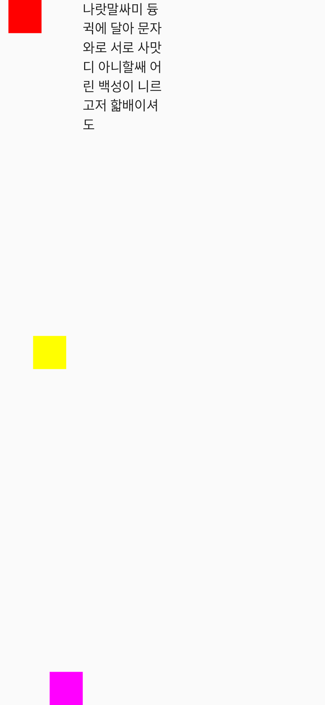

# Part4 Chapter4

Part4 Chapter4의 예제와 실습을 모두 담고 있습니다.

[최종본](../../tree/final)과 비교해보세요.

## Compose ConstraintLayout 실습코드 (part4-chapter4-3)

[part4-chapter4-3](part4-chapter4-3) 디렉토리를 Android Studio에서 오픈하세요.


 * 단계 1: "androidx.constraintlayout:constraintlayout-compose:1.0.1" 의존성을 추가합시다.

 * 단계 2: createRefs()를 이용해서 아래 박스들의 레퍼런스를 가져옵시다.
    createRefs는 여러개의 레퍼런스를 리턴하니 destruction으로 분해합시다.
    red, meganta, green, yellow 박스가 있습니다.

 * 단계 3: constraintsAs 모디파이어를 추가하고 레퍼런스를 전달합시다.
    후행 람다로 top, start, end, bottom 앵커를 지정하고
    linkTo 호출합니다.
    인자로는 parent의 앵커(top, start, end, bottom)을
    전달해봅시다.

 * 단계 4: linkTo의 키워드 인자 margin을 추가합시다.

 * 단계 5: 마젠타 박스를 parent의 start와 end에 연결합시다.

 * 단계 6: 그린 박스를 linkTo를 이용해서 정 가운데로 연결해봅시다.

 * 단계 7: 앵커 메서드 linkTo 대신에 centerTo 함수를 사용해봅시다.

 * 단계 8: 옐로 박스를 마젠타 박스 오른쪽 대각선 아래에 위치해봅시다.
    linkTo를 쓰고 인자로 parent 대신 그린 박스의 레퍼런스를 사용합시다.

## Compose ConstraintLayout (ConstraintSet) 실습코드 (part4-chapter4-4)

[part4-chapter4-4](part4-chapter4-4) 디렉토리를 Android Studio에서 오픈하세요.

 * 단계 1: createRefFor로 레드, 마젠타, 그린, 옐로 박스를 위한 레퍼런스를 만듭니다.
    파라미터 id로 레퍼런스의 이름을 적어 줍시다. eg. redBox

 * 단계 2: `constrain`을 열고 만들었던 레퍼런스를 인자로 넣읍시다.
    레드, 마젠타, 그린, 옐로 박스 레퍼런스에 대해 `constrain`을 적읍시다.
    후행 람다의 내용은 기존에 `constrainAs`에 적어둔 것을 참고합니다.

 * 단계 3: `ConstraintLayout`내에서 생성한 레퍼런스와 `constrainAs` 모디파이어를 삭제합니다.

 * 단계 4: Box마다 `layoutId`를 설정합니다.
    파라미터는 `ConstraintSet`에 만든 레퍼런스의 id로 적어줍니다.

 * 단계 5: ConstraintLayout의 첫 인자로 ConstraintSet을 전달합니다.

## Compose ConstraintLayout (Chain, Barrier) 실습코드 (part4-chapter4-5)

[part4-chapter4-5](part4-chapter4-5) 디렉토리를 Android Studio에서 오픈하세요.



 * 단계 1: `createVerticalChain`, `createHorizontalChain`를
   이용해서 세 박스의 레퍼런스를 연결해봅시다.

 * 단계 2: `createHorizontalChain`를 사용하고 `chainStyle`
   키워드 파라미터를 추가합시다.
   `ChainStyle.Packed`,`ChainStyle.Spread`,
   `ChainStyle.SpreadInside`등을 지정해봅시다.

 * 단계 3: 세 박스의 top을 parent.top에 연결하고 각각
   다른 마진을 줍시다.

 * 단계 4: `createBottomBarrier`로 배리어를 만듭시다.
   이는 모든 박스들의 하단을 포함하는 배리어입니다.

 * 단계 5: `Text` 하나 만들고 top을 박스 베리어로 지정합니다.

 * 단계 6: 체이닝 방향이나 베리어 방향을 바꾸어 보며 다양하게 테스트해봅시다.

## Compose ConstraintLayout 활용 실습코드 (part4-chapter4-6)

[part4-chapter4-6](part4-chapter4-6) 디렉토리를 Android Studio에서 오픈하세요.


 * 단계 1: 아래의 Row 레이아웃을 ConstraintLayout로 바꾸어 봅시다.

## Compose Canvas 활용 실습코드 (part4-chapter4-7)

[part4-chapter4-7](part4-chapter4-7) 디렉토리를 Android Studio에서 오픈하세요.


 * 단계 1: `drawLine`을 사용해봅시다. 파라미터로 색상, 시작(`Offset`)
    끝(`Offset` 타입)을 받습니다.

 * 단계 2: `drawCircle`을 사용해보세요. 색상, 반지름, 중앙(`Offset`)

 * 단계 3: 아래의 규칙으로 그려진 아이콘 `Icons.Filled.Send`를
   `drawLine`으로 변경해봅시다.
   ImageVector에서는 한붓 그리기 처럼 연속으로 그려집니다.
   `moveTo`로 2.01f, 21.0f로 이동한 후 거기에서
   23.0f, 12.0f로 선이 그어지는 식입니다.

```kotlin
moveTo(2.01f, 21.0f)
lineTo(23.0f, 12.0f)
lineTo(2.01f, 3.0f)
lineTo(2.0f, 10.0f)
lineToRelative(15.0f, 2.0f)
lineToRelative(-15.0f, 2.0f)
close()
```

## Compose Dialog 실습코드 (part4-chapter4-8)

[part4-chapter4-8](part4-chapter4-8) 디렉토리를 Android Studio에서 오픈하세요.


 * 단계 1: `openDialog`를 이용해 다이얼로그를 끌 수 있게 합니다.
 * 단계 2: "더하기" 버튼을 만들고 `counter`를 증가시킵니다. 다이얼로그도 끕니다.
 * 단계 3: "취소" 버튼을 만들고 다이얼로그를 끕니다.
 * 단계 4: 타이틀을 만듭니다. "더하기" 정도로 해봅시다.
 * 단계 5: 다이얼로그에서 설명할 문구를 출력합니다.