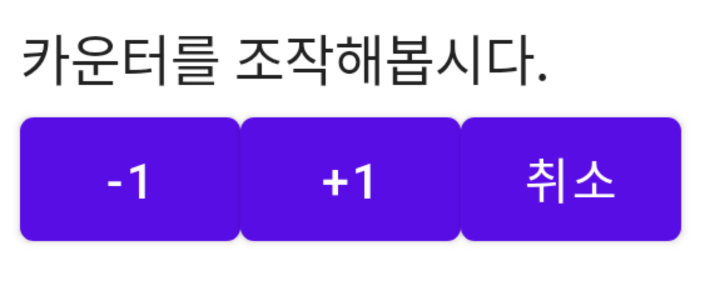
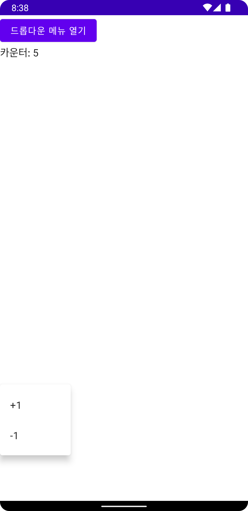
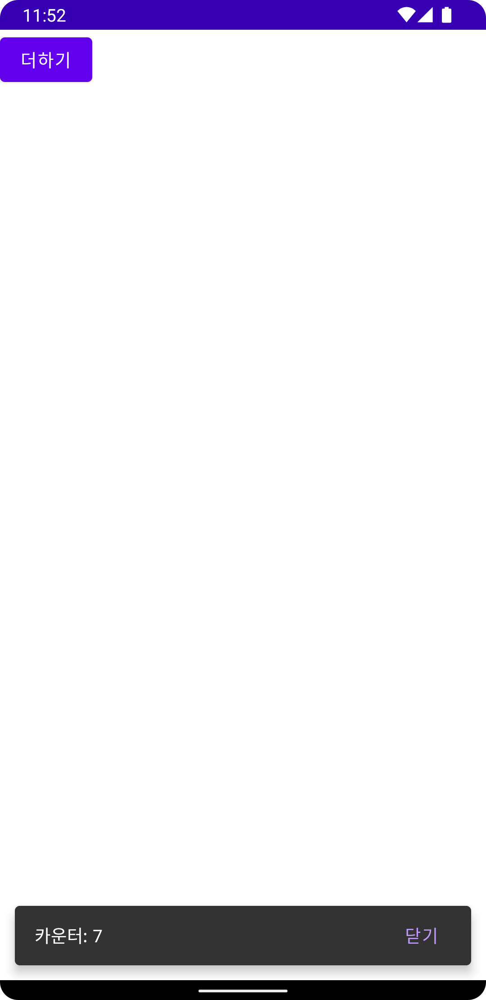
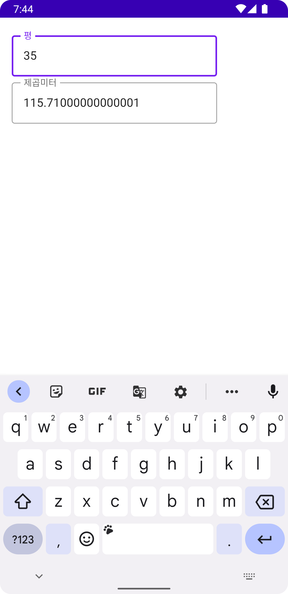
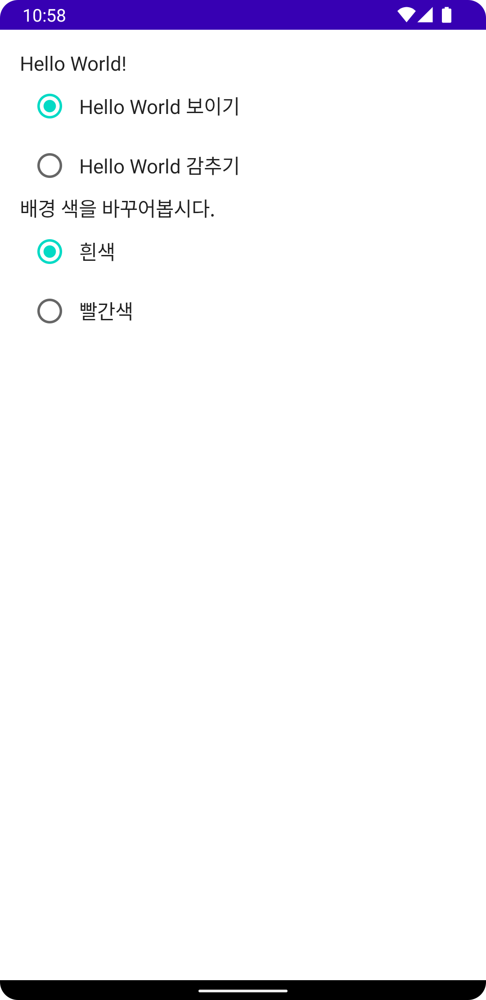
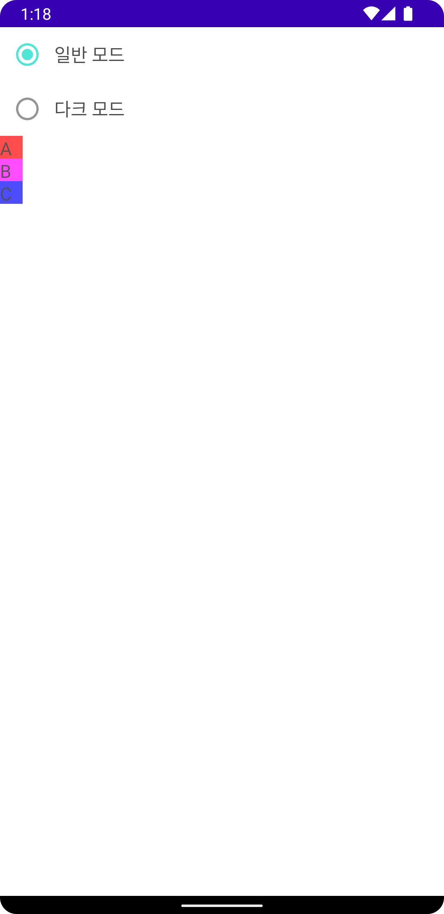

# Part4 Chapter4

Part4 Chapter4의 예제와 실습을 모두 담고 있습니다.

[최종본](../../tree/final)과 비교해보세요.

## Compose ConstraintLayout 실습코드 (part4-chapter4-3)

[part4-chapter4-3](part4-chapter4-3) 디렉토리를 Android Studio에서 오픈하세요.


 * 단계 1: "androidx.constraintlayout:constraintlayout-compose:1.0.1" 의존성을 추가합시다.

 * 단계 2: createRefs()를 이용해서 아래 박스들의 레퍼런스를 가져옵시다.
    createRefs는 여러개의 레퍼런스를 리턴하니 destruction으로 분해합시다.
    red, meganta, green, yellow 박스가 있습니다.

 * 단계 3: constraintsAs 모디파이어를 추가하고 레퍼런스를 전달합시다.
    후행 람다로 top, start, end, bottom 앵커를 지정하고
    linkTo 호출합니다.
    인자로는 parent의 앵커(top, start, end, bottom)을
    전달해봅시다.

 * 단계 4: linkTo의 키워드 인자 margin을 추가합시다.

 * 단계 5: 마젠타 박스를 parent의 start와 end에 연결합시다.

 * 단계 6: 그린 박스를 linkTo를 이용해서 정 가운데로 연결해봅시다.

 * 단계 7: 앵커 메서드 linkTo 대신에 centerTo 함수를 사용해봅시다.

 * 단계 8: 옐로 박스를 마젠타 박스 오른쪽 대각선 아래에 위치해봅시다.
    linkTo를 쓰고 인자로 parent 대신 그린 박스의 레퍼런스를 사용합시다.

## Compose ConstraintLayout (ConstraintSet) 실습코드 (part4-chapter4-4)

[part4-chapter4-4](part4-chapter4-4) 디렉토리를 Android Studio에서 오픈하세요.

 * 단계 1: createRefFor로 레드, 마젠타, 그린, 옐로 박스를 위한 레퍼런스를 만듭니다.
    파라미터 id로 레퍼런스의 이름을 적어 줍시다. eg. redBox

 * 단계 2: `constrain`을 열고 만들었던 레퍼런스를 인자로 넣읍시다.
    레드, 마젠타, 그린, 옐로 박스 레퍼런스에 대해 `constrain`을 적읍시다.
    후행 람다의 내용은 기존에 `constrainAs`에 적어둔 것을 참고합니다.

 * 단계 3: `ConstraintLayout`내에서 생성한 레퍼런스와 `constrainAs` 모디파이어를 삭제합니다.

 * 단계 4: Box마다 `layoutId`를 설정합니다.
    파라미터는 `ConstraintSet`에 만든 레퍼런스의 id로 적어줍니다.

 * 단계 5: ConstraintLayout의 첫 인자로 ConstraintSet을 전달합니다.

## Compose ConstraintLayout (Chain, Barrier) 실습코드 (part4-chapter4-5)

[part4-chapter4-5](part4-chapter4-5) 디렉토리를 Android Studio에서 오픈하세요.


 * 단계 1: `createVerticalChain`, `createHorizontalChain`를
   이용해서 세 박스의 레퍼런스를 연결해봅시다.

 * 단계 2: `createHorizontalChain`를 사용하고 `chainStyle`
   키워드 파라미터를 추가합시다.
   `ChainStyle.Packed`,`ChainStyle.Spread`,
   `ChainStyle.SpreadInside`등을 지정해봅시다.

 * 단계 3: 세 박스의 top을 parent.top에 연결하고 각각
   다른 마진을 줍시다.

 * 단계 4: `createBottomBarrier`로 배리어를 만듭시다.
   이는 모든 박스들의 하단을 포함하는 배리어입니다.

 * 단계 5: `Text` 하나 만들고 top을 박스 베리어로 지정합니다.

 * 단계 6: 체이닝 방향이나 베리어 방향을 바꾸어 보며 다양하게 테스트해봅시다.

## Compose ConstraintLayout 활용 실습코드 (part4-chapter4-6)

[part4-chapter4-6](part4-chapter4-6) 디렉토리를 Android Studio에서 오픈하세요.


 * 단계 1: 아래의 Row 레이아웃을 ConstraintLayout로 바꾸어 봅시다.

## Compose Canvas 활용 실습코드 (part4-chapter4-7)

[part4-chapter4-7](part4-chapter4-7) 디렉토리를 Android Studio에서 오픈하세요.


 * 단계 1: `drawLine`을 사용해봅시다. 파라미터로 색상, 시작(`Offset`)
    끝(`Offset` 타입)을 받습니다.

 * 단계 2: `drawCircle`을 사용해보세요. 색상, 반지름, 중앙(`Offset`)

 * 단계 3: 아래의 규칙으로 그려진 아이콘 `Icons.Filled.Send`를
   `drawLine`으로 변경해봅시다.
   ImageVector에서는 한붓 그리기 처럼 연속으로 그려집니다.
   `moveTo`로 2.01f, 21.0f로 이동한 후 거기에서
   23.0f, 12.0f로 선이 그어지는 식입니다.

```kotlin
moveTo(2.01f, 21.0f)
lineTo(23.0f, 12.0f)
lineTo(2.01f, 3.0f)
lineTo(2.0f, 10.0f)
lineToRelative(15.0f, 2.0f)
lineToRelative(-15.0f, 2.0f)
close()
```

## Compose Dialog 실습코드 (part4-chapter4-8)

[part4-chapter4-8](part4-chapter4-8) 디렉토리를 Android Studio에서 오픈하세요.


 * 단계 1: `openDialog`를 이용해 다이얼로그를 끌 수 있게 합니다.
 * 단계 2: "더하기" 버튼을 만들고 `counter`를 증가시킵니다. 다이얼로그도 끕니다.
 * 단계 3: "취소" 버튼을 만들고 다이얼로그를 끕니다.
 * 단계 4: 타이틀을 만듭니다. "더하기" 정도로 해봅시다.
 * 단계 5: 다이얼로그에서 설명할 문구를 출력합니다.

## Compose Custom Dialog 실습코드 (part4-chapter4-9)

[part4-chapter4-9](part4-chapter4-9) 디렉토리를 Android Studio에서 오픈하세요.



 * 단계 1: 디스미스 처리를 합니다.

 * 단계 2: 컬럼을 만들고 설명을 적어봅시다.

 * 단계 3: 컬럼 안에 로우를 만들어 수평 방향으로 버튼을 배열합니다.
   버튼은 +1, -1, 취소로 구성하겠습니다.
   +1은 counter를 증가시키고 -1은 감소, 취소는 다이얼로그를 닫습니다.

## Compose DropdownMenu 실습코드 (part4-chapter4-10)

[part4-chapter4-10](part4-chapter4-10) 디렉토리를 Android Studio에서 오픈하세요.



 * 단계 1: `DropdownMenu`를 만들고 `expanded`를 `expandDropDownMenu`로
   등록합시다.
   `onDismissRequest`에 대해서는 `expandDropDownMenu`를 `false`로 바꿉니다.

 * 단계 2: 두개의 `DropdownMenuItem`을 등록합시다. `onClick`을 구현하고
   내용물은 `Text`로 채워봅시다.

## Compose Snackbar 실습코드 (part4-chapter4-11)

[part4-chapter4-11](part4-chapter4-11) 디렉토리를 Android Studio에서 오픈하세요.



 * 단계 1: scaffoldState를 만들고 Scaffold에 설정합시다.
   scaffoldState를 만들기 위해 `rememberScaffoldState`를 사용합니다.

 * 단계 2: "더하기" 버튼을 만들어 봅시다.
   action에서 counter를 증가시킵시다.

 * 단계 3: couroutineScope를 만듭시다.
   `rememberCoroutineScope`를 사용합니다.

 * 단계 4: 버튼의 onClick에서 `coroutineScope.launch`를 사용합니다.

 * 단계 5: 스낵바를 사용하기 위해
   `scaffoldState.snackbarHostState.showSnackbar`사용합니다.
   `message`에 카운터를 출력합시다.
   `actionLabel`를 "닫기"로 지정합시다.
   `duration`에 `SnackbarDuration.Short`를 사용합니다.

## Compose BottomAppBar 실습코드 (part4-chapter4-12)

[part4-chapter4-12](part4-chapter4-12) 디렉토리를 Android Studio에서 오픈하세요.


 * 단계 1: `Scaffold`에 `scaffoldState`를 설정합니다.

 * 단계 2: `bottomBar` 파라미터에 `BottomAppBar`를 넣읍시다.
  내용은 텍스트와 버튼을 넣어 봅시다. 버튼에는 `snackBar`를
  연동해 메시지를 출력합니다.

 * 단계 3: 더하기와 빼기 버튼을 추가로 만들고 `MutableState`
  만듭시다. `Scaffold`의 `content`에 `Text`를 넣어 카운터를 출력하게
  합시다.

## Compose State와 State Hoisting 실습코드 (part4-chapter4-13)

[part4-chapter4-13](part4-chapter4-13) 디렉토리를 Android Studio에서 오픈하세요.




 * 단계 1: remember를 이용해 상태를 만들고 평 값을 입력하면
  제곱미터가 출력되도록 화면을 구성하시오.
  평을 제곱미터로 바꾸기 위해서는 3.306을 곱하면 됩니다.
  
 * 단계 2: `Composable` 함수를 만들고 `Column`의 항목들을 옮기세요.
  단 상태는 옮기지 말아야 합니다.
  파라미터는 아래와 같이 구성합니다.
  `pyeong: String, squareMeter: String, onPyeongChange: (String) -> Unit`

## Compose State와 Animation (1) 실습코드 (part4-chapter4-14)

[part4-chapter4-14](part4-chapter4-14) 디렉토리를 Android Studio에서 오픈하세요.



 * 단계 1: `Text`를 `AnimatedVisibility`로 감싸고 `visible`을
  `helloWorldVisible`로 지정해봅시다.

 * 단계 2: `enter` 파라미터를 바꾸어봅시다.

  예:
  ```kotlin
  expandHorizontally()
  scaleIn()
  slideInHorizontally()
  fadeIn()
  ```

 * 단계 3: `enter` 값을 덧셈으로 결합해봅시다.
  `exit`도 적절한 값을 설정해봅시다.

 * 단계 4: `backgroundColor`를 `animateColorAsState`로 변경하세요.

## Compose State와 Animation (2) 실습코드 (part4-chapter4-15)

[part4-chapter4-15](part4-chapter4-15) 디렉토리를 Android Studio에서 오픈하세요.



 * 단계 1: `updateTransition` 수행하고 `targetState`를 `isDarkMode`로
  설정합니다. `transition`으로 리턴을 받습니다.

 * 단계 2: `transition`에 대해 `animateColor`를 호출해 `backgroundColor`를 받습니다.
  배경색상을 만듭시다. false일 때 하얀 배경, true일 때 검은 배경.

 * 단계 3: 글자 색상을 만듭시다.

 * 단계 4: `animateFloat`를 호출해서 알파 값을 만듭시다.

 * 단계 5: 컬럼에 배경과 알파를 적용합시다.

 * 단계 6: 라디오 버튼에 글자 색을 적용합시다.

 * 단계 7: Crossfade를 이용해 `isDarkMode`가 참일 경우
  `Row`로 항목을 표현하고 거짓일 경우 `Column`으로 표현해봅시다.
